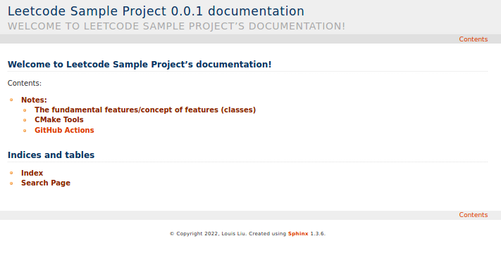

[](https://sphinx-c-plus-plus-practice.readthedocs.io/en/latest/?badge=latest)

## Sphinx C_plus_plus Practice

### Introduction ###

This library is the C++ version of Leetcode quiz. It is used for the Sphinx documentation tutorial specifically.

It is strongly recommneded to read [Breathe](https://breathe.readthedocs.io/en/latest/)’s documentation, which providds a bridge between the Sphinx and Doxygen documentation systems.

### Plot ###

This tutorial used a simple c++ project (Leetcode Sample Project) to demonstrates how to use Sphinx to generate HTML-based documents. The generatd documents look like the picture below.

<figure><center></center></figure>

### Files ###

The layout of the Leetcode Sample Project after we delete the docs and build folders in [`leetcode_practice`](leetcode_practice/) look like:

```
$ tree of leetcode_practice directory
.
├── CMakeLists.txt
├── examples
│   ├── CMakeLists.txt
│   └── unit
│       ├── CMakeLists.txt
│       ├── main.cc
│       └── unit
├── files
│   ├── CMakeLists.txt
│   ├── balancedstone.txt
│   ├── critical.txt
│   └── input.txt
├── include
│   ├── config.h
│   ├── config.h.in
│   └── solutions.h
├── src
│   ├── CMakeLists.txt
│   ├── README.md
│   ├── libsolutions.dylib
│   └── solutions.cc
└── tests
    ├── CMakeLists.txt
    ├── README.md
    └── leetcode_integration_test.cc
```

To build the code that configurated by in CMakeLists.txt file, you can follow with the commands below in the [`leetcode_practice`](\leetcode_practice) directory:
```
$ cmake -S . -B build
$ cmake --build build
```

### Installation ###

Assumptions and Requirements

+ Sphinx 3.1.2
+ C++ 14
+ Breathe 4.34.0
+ Doxygen 1.9.1
+ Boost

Note: Sphinx can run on Linux, Windows and MacOS. Although this tutorial uses MacOS, the steps are the same in the Windows and Linux.

## Reference ##

+ [Breathe’s documentation](https://breathe.readthedocs.io/en/latest/)

+ [C/C++ Documentation Using Sphinx](https://leimao.github.io/blog/CPP-Documentation-Using-Sphinx/)

+ [Using Sphinx for Python Documentation](https://shunsvineyard.info/2019/09/19/use-sphinx-for-python-documentation/)

+ [Sample Binary Tree Library](https://python-sample-code.readthedocs.io/en/latest/readme.html)
